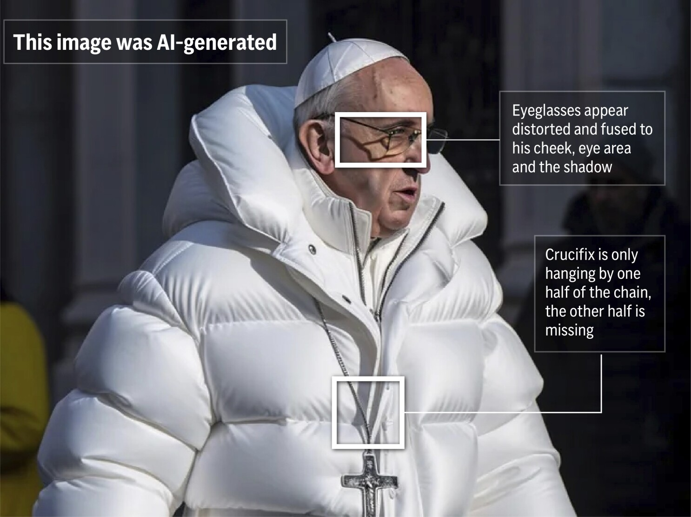

# VerifyAI Chrome Extension
## About
With this Chrome extension, you can verify information online in just a few clicks, without even needing to leave your tab.
* **Verify Text Claims:** Highlight text, right-click, and select "Verify Claim" to see a verdict, confidence level, reasoning and links to sources. This feature is powered by Perplexity AI.
* **Detect Deepfakes:** Right-click on an image and select "Detect Deepfake" to view the likelihood of it being AI-generated using multiple techniques. This feature is powered by open-source models readily available on Hugging Face.

**Limitations:** It is important to note that AI detection is not correct 100% of the time, and due diligence is still required by the user. This is especially the case for the deepfake detection function, whose models are trained on specific datasets. While they may detect images generated by Stable Diffusion, MidJourneyV6 or Flux with a high accuracy, images generated through other models may not be flagged.

**Issues:** The user may experience 'cold start' delays in the deepfake detection feature, as Google Cloud Run needs to re-instantiate the FastAPI service when handling a request after a period of inactivity.

Note that the deepfake models are hosted on Google Cloud Run, which is free only until 8 June 2025. If you'd like to use this extension yourself, build a Docker image from the backend folder, push the image to Google Cloud Run, and deploy your own FastAPI instance (or simply host it locally).

## How to use
1. Clone repository
``` bash
git clone https://github.com/niclee1803/Verify-AI-Chrome-Extension
```

2. Put in Perplexity API key in the background.js file (**Contact niclee1803@gmail.com or [@niclee1803](t.me/niclee1803) on Telegram for the API key for Techfest2025**)
``` javascript
const apiKey = "<PERPLEXITY_API_KEY>";
```

3. Open Chrome -> Manage Extensions. Make sure developer mode is enabled. Click "Load unpacked" (at the top left).
   
4. Load the "extension" directory.

5. Right click on any highlighted text/image in your browser. You should see a "Verify Claim"/"Detect Deepfake" option in the menu.

## Tools used
* Javascript, HTML, CSS for frontend
* Python, FastAPI for backend
* Pillow library for image processing
* Transformer library for deepfake model management
* PyTorch library for deepfake model inference
* Docker for containerisation
* Google Cloud Run for deployment of FastAPI

## Sources
* [sonar by Perplexity](https://sonar.perplexity.ai/) model for fact checking
* [flux-detector by LukasT9](https://huggingface.co/LukasT9/flux-detector) for deepfake detection
* [AI_ImageClassification_MidjourneyV6_SDXL by ideepankarsharma2003](https://huggingface.co/ideepankarsharma2003/AI_ImageClassification_MidjourneyV6_SDXL) for deepfake detection
* [sdxl-detector by Organika](https://huggingface.co/Organika/sdxl-detector) for deepfake detection

## Demo Video
<p align="center">
   <a href="https://youtu.be/wDFsjn5UWqk">
       
   </a>
</p>  

## Gallery
<p align="center">
  
  <br />
  <em>Right click on highlighted text</em>
</p>  

<p align="center">
  
  <br />
  <em>Fake news detection feature</em>
</p> 

<p align="center">
  
  <br />
  <em>Right click on image</em>
</p>  
 

<p align="center">
  
  <br />
  <em>Deepfake detection feature</em>
</p>  
